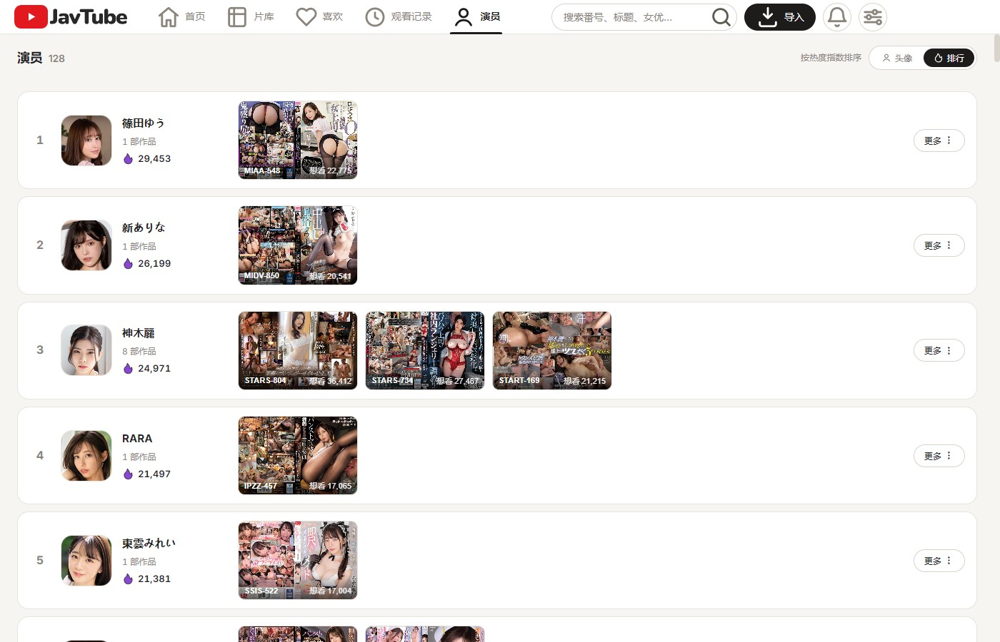
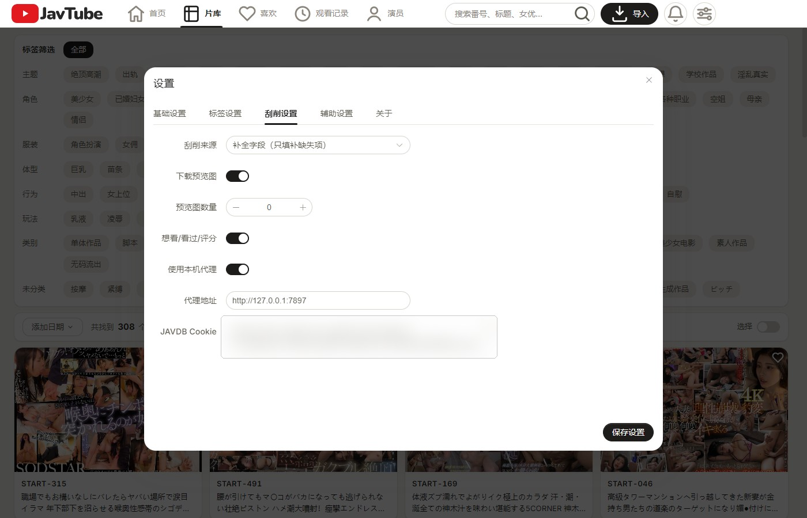

# JavTube

> 本地 JAV 影片管理软件：把硬盘里的影片导入进来，自动刮削元数据，用海报墙浏览、筛选、收藏和记录观看。

基于 Electron + Vue 3。所有数据（影片信息、标签、收藏、观看记录）只保存在本机 `data` 目录，**不上传任何内容**。无需注册，除刮削外均无需联网。


## 功能

### 首页

根据观看历史和收藏推荐影片，分三个板块：推荐轮播（每次打开推荐 5 部）、喜爱类别（按近期观看统计）、每日上新（推送 8 部不常看的类别）。


### 片库

海报墙加标签筛选。标签按主题、角色、服装、体型、行为等分组，支持多选；可调整排序、每行数量和每页数量，支持批量操作。


### 影片详情

展示番号、日期、时长、评分、想看/看过人数、导演、片商、类别、演员，底部为预览图。可直接调用本地播放器播放。


### 演员

库内女优头像墙，按作品数量排序。可切换为热度排行：按热度指数降序，每行显示名次、头像和想看人数最高的 3 部影片，火焰图标按名次分 7 档颜色。




### 女优影片页

某位女优的全部影片，带标签筛选和排序，右上角显示评分指数与热度。


### 喜欢与观看记录

喜欢页存放收藏的影片；观看记录页列出播放过的影片和播放次数。


### 刮削

集成 JAVBUS 和 JAVDB 两个源，同时抓取补全字段：番号、标题、导演、片商、系列、类别、女优（含头像）、评分、想看/看过人数、预览图。JAVDB 需要在设置里填入 Cookie 并配置代理；不想抓取的字段可以在设置里关闭。



## 本地开发

```bash
# 1. 安装依赖
npm install

# 2. 开发模式（Vite 热更新 + Electron）
npm run dev

# 3. 代码检查
npm run check:undefined

# 4. 打包 Windows x64 zip（输出到 release/）
npm run release
```

## 声明

本软件仅为**本地媒体文件管理工具**，不提供、不存储、不分发任何媒体内容。刮削功能抓取的元数据来自公开网站，仅供个人整理收藏使用。请遵守所在地区的法律法规，合理使用本软件。

## 许可证

[MIT](LICENSE)
